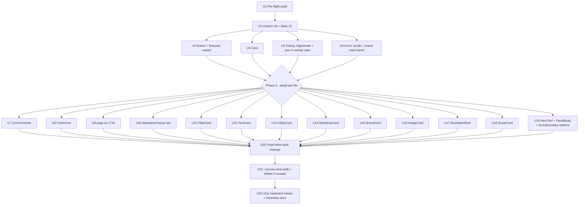

# refactor: Migrate tw-brand-website to 100% shadcn/ui on Base UI primitives

## Overview

This plan completes the migration started in `refactor/code-review-cleanup` (5 commits already on the branch). That branch put the 4 modal overlays onto Base UI via a single hand-rolled `<Dialog>` wrapper. This plan takes the rest of the UI surface — every button, every card, every generic icon — onto shadcn/ui's component templates, which (as of January 2026) ship officially on the Base UI primitive layer.

What this is not: rebuilding the canvas, sticker physics, stamp cursor, minimap, `GlowCard`'s cursor-tracking effect, or the edge vignette. Those have no shadcn/Base UI analogue and must remain bespoke.

The driver is a designer's expressed preference for "fewer moving parts" and a single, coherent component library, plus the latent a11y/consistency wins from getting every interactive element on one accessible foundation.

---

## Problem Frame

The repo currently has three concentric layers of UI:

1. **One Base UI primitive in use** (the `Dialog` we just shipped) — 4 overlays use it
2. **A `.canvas-card` CSS class** that abstracts visual chrome (bg, border, shadow, radius) and is shared across 8 components
3. **Everything else is bespoke** — 26 `<button>` elements across 11 files, 23 hand-rolled `<svg>` icons across 9 files, 7 cards that each re-implement the same chrome with subtle variation

The visible costs:
- Inconsistent focus rings (each button hand-rolls its own)
- Inconsistent close-button SVGs (3 separate copies)
- 21 inline `fontFamily: 'var(--font-display, ...)'` strings — a font swap is a grep-and-pray
- No semantic slots on cards (no `CardHeader`/`CardContent`) — every card invents its own structure
- The `featured` variant of `BrandCard` is a one-off 48px serif italic chrome that lives outside any system

The fix: adopt shadcn's component templates on Base UI, keep what's genuinely bespoke bespoke, and document where the line is.

---

## Requirements Trace

- R1. Every interactive element with a shadcn/Base UI analogue (button, card, dialog) is built from shadcn templates on the Base UI primitive layer.
- R2. The current visual fidelity (Linear-inspired aesthetic, TW Accent #0064FF, Plus Jakarta Sans display, Inter body, generous whitespace, subtle shadow chrome) is preserved.
- R3. Surfaces with no shadcn/Base UI analogue (canvas pan/zoom, stickers, stamp cursor, minimap, GlowCard, edge vignette) remain bespoke. The boundary is documented.
- R4. Brand-specific iconography (folder icon, stacked-cards illustration preview, canvas stamp) stays as custom SVGs. Generic UI icons (close X, chevrons, zoom controls) migrate to lucide-react.
- R5. `BrandCard`'s featured variant survives the migration as a registered `featured` variant on the shadcn `Button` config — not as a separate bespoke component.
- R6. A11y posture matches or exceeds the post-refactor baseline: every interactive element has a focus-visible ring, every modal has focus trap + Escape + scroll lock + focus restore, every dialog uses the same primitive.
- R7. The migration runs in incremental commits on top of `refactor/code-review-cleanup`. Each commit ships independently; the branch never has a half-broken intermediate state.
- R8. The 81 remaining inline tokenized styles (e.g., `style={{ color: 'var(--text-secondary)' }}`) get converted to Tailwind utilities as a paired-with-migration concern, not as a separate later cleanup.

---

## Scope Boundaries

- Not rebuilding canvas pan/zoom (`useCanvasPan`), `CanvasViewport`, `CanvasLayout`, `StackLayout`
- Not replacing `GlowCard` — its cursor-tracking blob is a deliberate signature effect with no library analogue
- Not replacing custom SVG brand marks: the folder icon (`FolderIcon`), the stacked-cards illustration preview (`IllustrationReel`'s stack), the canvas stamp imprints (`CanvasStamp`)
- Not introducing Motion-based animation libraries. Dialog animations already use CSS data-attribute transitions; shadcn's stock Dialog uses the same pattern
- Not introducing a test framework (Playwright, Storybook, Vitest). Verification is build + manual visual smoke. Adding one is a follow-on decision
- Not changing the routing structure (`/` and `/canvas` stay as they are)
- Not changing the data files in `src/data/` — content is stable

### Deferred to Follow-Up Work

- Storybook or Playwright test infrastructure — a separate plan if the team wants automated visual regression
- Migration of `PanelBody` content-block renderers (text, image, color-swatch, asset-list, guideline, divider) and `CardModal`'s `SectionRenderer` to a shared block primitive — these are content renderers with variant-conditional logic, not UI primitives shadcn has analogues for
- Dark mode — the existing `:root` token system has no `.dark` variant; adding one is a separate brand decision

---

## Context & Research

### Relevant Code and Patterns

- `src/components/ui/dialog.tsx` — the existing thin wrapper around Base UI `Dialog`. This will be replaced by `npx shadcn add dialog` (Base UI variant), which produces the same shape with shadcn's slot conventions (`DialogContent`, `DialogHeader`, `DialogTitle`, `DialogClose`)
- `src/app/globals.css` — Tailwind v4 `@theme inline` block already exposes design tokens to Tailwind utilities (`text-text-primary`, `font-display`, `bg-accent`, etc.). The shadcn Button/Card configs will key off these
- `src/components/items/{Pillar,Text,Utility,Manifesto,Brand,Image}Card.tsx` and `src/components/items/IllustrationReel.tsx` — the 7 cards to migrate
- `src/components/items/GlowCard.tsx` — bespoke, stays as-is. Reference for why this one is special
- `src/data/canvas-items.ts` — data shape for the canvas; no changes needed
- Existing focus-visible pattern (`focus-visible:outline-2 focus-visible:outline-offset-2 focus-visible:outline-accent`) was added in the recent refactor and is the convention to mirror in shadcn Button variants

### Institutional Learnings

- (No `docs/solutions/` exists yet in this repo. The recent code review surfaced enough learnings to inform this plan directly; capturing them after the migration ships is a follow-on docs task.)

### External References

- shadcn/ui Base UI changelog (Jan 2026): https://ui.shadcn.com/docs/changelog/2026-01-base-ui — official Base UI primitive support in the `npx shadcn create` flow via the `style` field (`base-vega` etc.)
- shadcn/ui Tailwind v4 docs: https://ui.shadcn.com/docs/tailwind-v4 — fully compatible; new projects default to v4; `tailwindcss-animate` replaced by `tw-animate-css`; `forwardRef` removed in favor of `React.ComponentProps`
- shadcn/ui Card (Base UI): https://ui.shadcn.com/docs/components/base/card — composition is `Card > CardHeader (CardTitle, CardDescription, CardAction) > CardContent > CardFooter` with a `size` prop (`default`/`sm`)
- shadcn/ui React 19: https://ui.shadcn.com/docs/react-19 — no runtime breakage; community confirms Next.js 16 + React 19 + shadcn works
- Dialog animation pattern: https://shadcnstudio.com/docs/components/dialog — Tailwind transitions keyed on `data-state="open|closed"` (matches what this repo already does)

---

## Key Technical Decisions

- **Primitive backend: Base UI, not Radix.** Per the Jan 2026 shadcn changelog and to align with the `@base-ui-components/react@1.0.0-rc.0` dependency already installed and used by `src/components/ui/dialog.tsx`. Selected during `npx shadcn create`.
- **Card primitive: adopt `shadcn/Card` and use its slots.** The composition (Header/Title/Description/Content/Footer/Action) is richer than a div wrapper around `.canvas-card` and gives every card semantic slots without rewriting variation.
- **`BrandCard` featured variant: register `featured` as a `Button` variant.** Preserves the 48px serif italic editorial moment as a one-off variant rather than a separate component. (Confirmed in planning Q&A.)
- **Icon strategy: hybrid.** lucide-react for everything generic (`X`, `ChevronLeft/Right`, `ZoomIn/Out/RotateCcw`, `ImageIcon`). Custom SVGs stay for brand marks: `FolderIcon`'s folder, `IllustrationReel`'s stacked-cards preview, `CanvasStamp` imprints. (Confirmed in planning Q&A.)
- **Existing `<Dialog>` wrapper: replace with `shadcn add dialog`.** Our hand-rolled wrapper was a simpler version of the same thing on Base UI. Taking shadcn's official version gives us standard slots (`DialogContent`, `DialogHeader`, `DialogTitle`, `DialogClose`) that downstream components and any future shadcn primitives will rely on. Migrate the 4 existing overlay sites to the slot API in the same unit.
- **`.canvas-card` CSS class: phase out.** Once cards migrate to `shadcn/Card`, the class is only referenced by `CanvasStamp` (which is bespoke anyway). Inline the styles into `CanvasStamp` and delete the class.
- **Animation: no Motion runtime dependency added.** Both our existing `Dialog` and shadcn's stock `Dialog` use CSS data-attribute transitions. Stay on that pattern. `Motion` continues to be used in `page.tsx`, `ImageCard`, and `CanvasViewport` for non-dialog animations — those are unchanged.
- **No `forwardRef` migration needed.** Pre-flight grep confirmed zero `forwardRef` usages in `src/`. shadcn's `React.ComponentProps` convention applies to new components only.
- **Tailwind v4 compatibility:** `tailwindcss-animate` is not installed (pre-flight confirmed), so no swap to `tw-animate-css` is needed. shadcn's generated configs can be added directly.
- **Verification: build + manual visual smoke + a11y keyboard sweep.** No new test framework. The user (designer) will spot-check the brand surface; build + lint + dev-server-200 are the automated tripwires.

---

## Open Questions

### Resolved During Planning

- *Should we preserve `BrandCard`'s featured variant or normalize it?* → Preserve as a registered `featured` Button variant.
- *Lucide vs custom SVGs?* → Hybrid: lucide for generic, custom for brand marks.
- *Replace or keep the existing `src/components/ui/dialog.tsx` wrapper?* → Replace with `npx shadcn add dialog` (Base UI variant) and refactor the 4 overlay sites to the slot API.
- *Is shadcn on Tailwind v4 + Next.js 16 + React 19 actually compatible?* → Yes, confirmed by 2026 changelog and community-verified starters.

### Deferred to Implementation

- *Exact shadcn `style` value to pick during `init` (e.g., `new-york-vega` vs `base-vega` vs whatever the CLI offers in June 2026).* → Resolve at U2 by reading the CLI's interactive choices; pick the Base UI variant closest to a clean, minimal-chrome aesthetic. Document the choice in `components.json`.
- *Exact `Button` variant names to define beyond `default` and `featured`.* → Resolve as each consuming unit lands; likely candidates are `ghost` (close buttons, icon-only), `outline` (cancel/secondary), `link` (the page.tsx CTA). Don't pre-create variants nothing uses.
- *Whether `IllustrationPopup`'s navigation arrows belong as `ghost` Buttons inside the dialog or as a custom carousel chrome.* → Resolve at U10; if the visual cost of standardizing is high, leave the dot indicator bespoke and only migrate the arrows.
- *Whether to delete the `.canvas-card` CSS class entirely or keep it for `CanvasStamp`.* → Resolve at U20 by greping for remaining consumers post-migration.

---

## Output Structure

The migration adds these new files to the repo:

    .
    ├── components.json                          # NEW — shadcn config (Base UI variant)
    └── src/
        ├── components/
        │   ├── icons/
        │   │   └── index.ts                      # NEW — lucide re-exports + custom brand-mark exports
        │   └── ui/
        │       ├── button.tsx                    # NEW — shadcn Button (Base UI) + `featured` variant
        │       ├── card.tsx                      # NEW — shadcn Card (Base UI)
        │       └── dialog.tsx                    # REPLACED — shadcn-generated Dialog (Base UI)
        └── lib/
            └── utils.ts                          # NEW — shadcn's cn() helper (clsx + tailwind-merge)

Existing files in `src/components/items/`, `src/components/panel/`, `src/components/cards/`, `src/components/canvas/`, and `src/app/` are modified in place — no new files outside the structure above.

---

## High-Level Technical Design

> *This illustrates the intended approach and is directional guidance for review, not implementation specification. The implementing agent should treat it as context, not code to reproduce.*

The migration follows a **scaffold → primitives → adopt-per-file → cleanup** sequence. The dependency graph between units:

Every unit in Phase 3 touches exactly one file and can run in parallel with any other unit in Phase 3 — there's no file overlap between them. The serial gates are: Phase 0 → Phase 1 → Phase 2 → Phase 3 (any order, parallelizable) → Phase 4.

---

## Implementation Units

### Phase 0 — Pre-flight

- U1. **Pre-flight audit**

**Goal:** Confirm no Tailwind v4 / shadcn migration gotchas apply before installing tooling.

**Requirements:** R1, R7

**Dependencies:** None

**Files:**
- (read-only audit; no files modified)

**Approach:**
- Confirm `tailwindcss-animate` is absent from `package.json` (already verified during planning — clean)
- Confirm no `forwardRef` usages in `src/` (already verified during planning — clean)
- Confirm `components.json` is absent (already verified — clean)
- Re-read `src/app/globals.css` `@theme inline` block and note the token names that shadcn-generated components will reference (`text-text-primary`, `font-display`, `bg-accent`, etc.)
- Confirm the current branch `refactor/code-review-cleanup` is checked out and has the 5 expected commits as its base

**Patterns to follow:**
- Pre-flight findings from the planning research apply directly here

**Test scenarios:**
- Test expectation: none — read-only audit unit

**Verification:**
- A written checklist (in the implementation commit message or PR description) confirming all 4 pre-flight items, so the next implementer can trust the assumptions

---

### Phase 1 — Tooling foundation

- U2. **`npx shadcn init` with Base UI primitive backend**

**Goal:** Bootstrap shadcn/ui in the repo with Base UI as the primitive layer.

**Requirements:** R1, R7

**Dependencies:** U1

**Files:**
- Create: `components.json`
- Create: `src/lib/utils.ts` (shadcn's `cn()` helper)
- Modify: `package.json` (adds `clsx`, `tailwind-merge`, `lucide-react`, possibly `class-variance-authority`)
- Modify: `src/app/globals.css` (shadcn `init` may add a `@layer base` block; reconcile with existing tokens)

**Approach:**
- Run `npx shadcn@latest init` and choose: TypeScript, Tailwind v4, Base UI primitive backend, the closest-to-minimal style preset offered (likely `new-york` or `base-vega` — confirm interactively at execution time)
- Set the alias paths to match the existing `@/` convention (already configured in `tsconfig.json`)
- Install `lucide-react` as part of init (shadcn prompts for it)
- Verify the resulting `components.json` lists the Base UI variant
- Read whatever globals.css block shadcn adds; ensure it doesn't conflict with the existing `--accent`/`--card-bg`/etc. tokens. If shadcn adds its own token names (e.g., `--primary`, `--background`), map them to the TW tokens (`--accent`, `--canvas-bg`) so shadcn components inherit brand colors out of the box
- Run `npm run build` to confirm no regressions

**Patterns to follow:**
- Existing `tsconfig.json` path aliases (`@/*` → `./src/*`)
- Existing `@theme inline` token names in `src/app/globals.css`

**Test scenarios:**
- Happy path: `npm run build` passes after init with no new TypeScript or CSS errors
- Edge case: Existing routes (`/` and `/canvas`) still return `200 OK` from `npm run dev` — no rendering regression from globals.css changes

**Verification:**
- `components.json` exists at repo root with Base UI primitive variant selected
- `src/lib/utils.ts` exports `cn()` and is importable from `@/lib/utils`
- `npm run build` clean
- `curl http://localhost:3000/` and `/canvas` both return 200 with the previous visual

---

### Phase 2 — Generate primitives

These three units have no file overlap and can be dispatched in parallel after U2.

- U3. **Add shadcn `Button` (Base UI) and register `featured` variant**

**Goal:** Generate `src/components/ui/button.tsx` from shadcn and extend it with a `featured` variant that preserves `BrandCard`'s 48px serif italic chrome.

**Requirements:** R1, R5, R6

**Dependencies:** U2

**Files:**
- Create: `src/components/ui/button.tsx`

**Approach:**
- Run `npx shadcn@latest add button`
- After generation, read the variant config (`cva`-based or whatever shadcn ships in 2026) and add a `featured` variant whose styles match `BrandCard`'s current `variant === "featured"` block in `src/components/items/BrandCard.tsx`: blue background (`bg-accent`), `rounded-3xl`, no border, padding `px-7 py-8`, flex-end column layout, white text using Plus Jakarta Sans, supports children with the 48px display sizes
- The `default` variant should match the project's existing button chrome (focus-visible:outline-2 outline-accent, rounded-lg, transition-opacity, accent background, white text)
- Add a `ghost` variant for icon-only close/nav buttons (no background, hover:opacity-60)
- Add an `iconOnly` size for the close-button shape (w-8 h-8 or w-10 h-10)

**Patterns to follow:**
- Current focus-visible pattern in the refactored modals: `focus-visible:outline-2 focus-visible:outline-offset-2 focus-visible:outline-accent`
- `BrandCard.tsx` lines 16–60 for the `featured` chrome specifics
- shadcn's official Button + cva docs: https://ui.shadcn.com/docs/components/base/button

**Test scenarios:**
- Happy path: Importing `Button` from `@/components/ui/button` compiles and renders the default variant with TW accent background
- Happy path: `<Button variant="featured">Why\nAesthetics\nmatters?</Button>` renders the 48px serif italic chrome visually identical to BrandCard's current featured state (manual visual diff)
- Happy path: `<Button variant="ghost" size="iconOnly" aria-label="Close">` renders the close-button shape and shows a focus ring on tab
- Edge case: `<Button asChild>` wrapping a `<Link>` from `next/link` works (needed for the page.tsx CTA in U9)

**Verification:**
- `npm run build` clean
- All 4 variants (`default`, `featured`, `ghost`, optionally `outline`/`link`) render in a sandbox or by previewing `BrandCard` post-U15

---

- U4. **Add shadcn `Card` (Base UI)**

**Goal:** Generate `src/components/ui/card.tsx` from shadcn with the Header/Title/Description/Content/Footer/Action slot composition.

**Requirements:** R1, R2

**Dependencies:** U2

**Files:**
- Create: `src/components/ui/card.tsx`

**Approach:**
- Run `npx shadcn@latest add card`
- Verify the generated component has the documented slot composition: `Card > CardHeader (CardTitle, CardDescription, CardAction) > CardContent > CardFooter` and the `size` prop (`default`/`sm`)
- Match the visual baseline of `.canvas-card`: white background (`bg-card-bg`), 1px border (`border-card-border`), `rounded-2xl`, the same subtle shadow (`shadow-[0_1px_3px_rgba(0,0,0,0.04)]`)
- The shadcn defaults may need slight token swaps to match — edit the generated file's classnames to use our tokens (`bg-card-bg`, `border-card-border`) rather than shadcn's defaults (`bg-card`, `border`)

**Patterns to follow:**
- `.canvas-card` styles in `src/app/globals.css` (the baseline visual)
- shadcn Card composition: https://ui.shadcn.com/docs/components/base/card

**Test scenarios:**
- Happy path: Importing `Card`, `CardHeader`, `CardTitle`, `CardContent` compiles
- Happy path: A `<Card><CardHeader><CardTitle>Test</CardTitle></CardHeader><CardContent>body</CardContent></Card>` renders with white bg, 1px border, rounded-2xl, matching the current `.canvas-card` aesthetic side-by-side

**Verification:**
- `npm run build` clean
- Side-by-side visual: a sample `Card` looks identical to a `.canvas-card`-classed div with the same content

---

- U5. **Replace existing `<Dialog>` with shadcn-generated Dialog; port 4 overlay sites to the slot API**

**Goal:** Replace the hand-rolled `src/components/ui/dialog.tsx` with `npx shadcn add dialog` (Base UI variant) and refactor `FolderModal`, `CardModal`, `IllustrationPopup`, and `QuoteCard`'s inline `QuoteModal` to use the slot-based API (`Dialog`, `DialogContent`, `DialogHeader`, `DialogTitle`, `DialogDescription`, `DialogClose`).

**Requirements:** R1, R6, R7

**Dependencies:** U2

**Files:**
- Modify: `src/components/ui/dialog.tsx` (overwrite via `shadcn add dialog`)
- Modify: `src/components/panel/FolderModal.tsx`
- Modify: `src/components/cards/CardModal.tsx`
- Modify: `src/components/items/IllustrationPopup.tsx`
- Modify: `src/components/items/QuoteCard.tsx`
- Modify: `src/app/globals.css` (the `.tw-dialog-backdrop` / `.tw-dialog-popup` classes can likely be removed once shadcn ships its own Tailwind classes for the same data-state transitions)

**Approach:**
- Run `npx shadcn@latest add dialog`; let it overwrite the existing `dialog.tsx`. Note the shadcn-generated component exposes named exports (`Dialog`, `DialogContent`, etc.) rather than our previous single default export
- For each of the 4 overlay sites, replace the previous `<Dialog open ariaLabel popupClassName>` shape with the slot composition: `<Dialog open onOpenChange><DialogContent aria-label><DialogHeader><DialogTitle/><DialogDescription/></DialogHeader>...<DialogClose/></DialogContent></Dialog>`
- Keep the close-button SVG inside `DialogClose` (or migrate to lucide `X` if U6 lands first — coordinate sequencing)
- Verify the backdrop blur + cubic-bezier popup transitions still feel correct. If shadcn's defaults differ, override classNames on `DialogContent`/`DialogOverlay` to keep the current feel
- Remove the now-redundant `.tw-dialog-backdrop` and `.tw-dialog-popup` rules from `globals.css` once verified

**Patterns to follow:**
- Current 4 overlay implementations after the refactor branch — they're the visual baseline to preserve
- shadcn Dialog (Base UI): https://ui.shadcn.com/docs/components/base/dialog

**Test scenarios:**
- Happy path: Open and close `FolderModal` via clicking a folder; backdrop blur + content fade-in match current feel
- Happy path: Open and close `CardModal` via clicking a brand-pillar card; same
- Happy path: Open `IllustrationPopup`; arrow keys still navigate slides; Escape closes; Tab cycles within
- Happy path: Open `QuoteCard`'s modal; Escape closes (previously broken — must remain fixed)
- Edge case: Open `IllustrationPopup`, Tab to the close button, Shift+Tab back to the last focusable — focus trap remains intact
- Edge case: Open any modal, click backdrop — modal closes
- Integration: Opening a modal disables interaction with `CanvasViewport` behind it (the pan/zoom hook's `disabled: isOverlayOpen || !isDesktop` continues to fire — verify by attempting to drag the canvas while a modal is open)

**Verification:**
- All 4 modals open/close cleanly via mouse and keyboard
- `npm run build` clean
- A11y sweep: focus is trapped inside each modal; focus restores to trigger on close

---

- U6. **Install lucide-react and create icon barrel**

**Goal:** Set up the icon strategy: lucide for generic icons, a barrel file that re-exports lucide + custom brand-mark SVG components.

**Requirements:** R4

**Dependencies:** U2 (lucide is typically installed during `shadcn init`; if not, install here)

**Files:**
- Create: `src/components/icons/index.ts` (or `index.tsx` if it embeds JSX for brand marks)
- Create: `src/components/icons/FolderMark.tsx` (extracted from existing `FolderIcon.tsx` — the brand-specific folder shape)
- Create: `src/components/icons/IllustrationStack.tsx` (extracted from existing `IllustrationReel.tsx` — the stacked-cards preview shape)
- (Optional) Modify: `package.json` if lucide isn't already in dependencies post-U2

**Approach:**
- Verify `lucide-react` is in `package.json` from U2; install if missing
- Create `src/components/icons/index.ts` that re-exports the lucide icons used in this codebase: `X`, `ChevronLeft`, `ChevronRight`, `ZoomIn`, `ZoomOut`, `RotateCcw`, `ImageIcon`
- For brand marks (folder shape from `FolderIcon`, stacked-cards from `IllustrationReel`), extract the SVG markup into dedicated files (`FolderMark.tsx`, `IllustrationStack.tsx`) so they're importable from the same barrel: `import { FolderMark, IllustrationStack, X, ChevronLeft } from "@/components/icons"`
- Decision: the stamp imprint SVG in `CanvasStamp.tsx` is **not** a UI icon — it's an interactive canvas effect. It stays inline in `CanvasStamp.tsx` and is not part of the barrel

**Patterns to follow:**
- Existing custom SVGs in `FolderIcon.tsx` and `IllustrationReel.tsx` (lines 24–58 of IllustrationReel)
- lucide-react import style: `import { X } from "lucide-react"`

**Test scenarios:**
- Happy path: Importing `X` from `@/components/icons` renders a lucide X icon
- Happy path: Importing `FolderMark` from `@/components/icons` renders the existing folder brand mark identically
- Happy path: `<X className="size-4" />` (shadcn convention) sizes correctly

**Verification:**
- `npm run build` clean
- `FolderMark` and `IllustrationStack` render pixel-identical to their previous inline definitions

---

### Phase 3 — Adopt per file (parallelizable)

All Phase 3 units depend on U3 (Button), U4 (Card), U5 (Dialog), U6 (Icons). Within Phase 3, no two units modify the same file, so they're safe to dispatch in parallel.

- U7. **Migrate `ZoomControls` to shadcn Button + lucide icons**

**Goal:** Replace the 3 hand-rolled buttons + 3 inline SVGs in ZoomControls with `<Button variant="ghost" size="iconOnly">` + lucide icons.

**Requirements:** R1, R4, R6, R8

**Dependencies:** U3, U6

**Files:**
- Modify: `src/components/canvas/ZoomControls.tsx`

**Approach:**
- Replace the `<button>` markup for zoom-in, zoom-out, reset with `<Button variant="ghost" size="iconOnly" aria-label=...>`
- Replace inline SVGs with lucide `ZoomIn`, `ZoomOut`, `RotateCcw`
- Convert any remaining inline tokenized styles to Tailwind utilities

**Patterns to follow:**
- shadcn Button `ghost` variant
- lucide-react `className="size-4"` sizing convention

**Test scenarios:**
- Happy path: Clicking each button still calls the corresponding `zoomIn`/`zoomOut`/`resetZoom` from `useCanvasPan`
- Happy path: Each button has a visible focus ring on tab
- Happy path: Visual diff matches the current ZoomControls appearance

**Verification:**
- Pan/zoom still works on `/canvas`
- `npm run build` clean

---

- U8. **Migrate `FolderIcon` to shadcn Button wrapper (folder mark stays brand-custom)**

**Goal:** Wrap the folder trigger in a shadcn `Button` (likely `ghost` variant) while keeping the folder SVG as the imported `FolderMark` from `@/components/icons`.

**Requirements:** R1, R4, R6, R8

**Dependencies:** U3, U6

**Files:**
- Modify: `src/components/items/FolderIcon.tsx`

**Approach:**
- Wrap the existing trigger element in `<Button variant="ghost" ...>`
- Replace inline SVG with `<FolderMark />` from `@/components/icons`
- Preserve hover/active visuals (the folder lift effect on hover)
- Convert remaining inline tokenized styles

**Test scenarios:**
- Happy path: Clicking a folder icon on `/canvas` still opens `FolderModal` with the correct content
- Happy path: Focus ring appears on tab
- Happy path: Hover lift animation still feels right

**Verification:**
- All folders on `/canvas` open their modals correctly

---

- U9. **Migrate `src/app/page.tsx` CTA to `<Button asChild><Link>`**

**Goal:** Replace the homepage "Open Brand Workspace" `<Link>` chrome with `<Button asChild variant="default" size="lg"><Link href="/canvas">Open Brand Workspace</Link></Button>`.

**Requirements:** R1, R6, R8

**Dependencies:** U3

**Files:**
- Modify: `src/app/page.tsx`

**Approach:**
- Use shadcn Button's `asChild` prop (forwards the Button styles onto the wrapped `<Link>`)
- Preserve the current visual: rounded-full, accent background, white text, hover accent-hover
- Convert remaining inline tokenized styles in `page.tsx` (8 occurrences) to Tailwind utilities

**Patterns to follow:**
- shadcn Button `asChild` pattern: https://ui.shadcn.com/docs/components/base/button#as-child

**Test scenarios:**
- Happy path: Clicking "Open Brand Workspace" navigates to `/canvas`
- Happy path: Visual diff matches the current CTA (rounded-full, hover state)
- Happy path: Focus ring appears on tab

**Verification:**
- Navigation works
- Visual matches

---

- U10. **Migrate `IllustrationPopup` nav arrows and dots to shadcn Button + lucide**

**Goal:** Replace the left/right arrow buttons and dot indicators in IllustrationPopup with `<Button>` + lucide `ChevronLeft`/`ChevronRight`. Keep the placeholder image SVG as-is (it's a placeholder, not a final asset).

**Requirements:** R1, R4, R6

**Dependencies:** U3, U5, U6

**Files:**
- Modify: `src/components/items/IllustrationPopup.tsx`

**Approach:**
- Replace arrow `<button>`s with `<Button variant="ghost" size="iconOnly">` containing lucide `ChevronLeft`/`ChevronRight`
- Decide whether dot indicators should be a custom row (likely keep — they're not a generic Button shape) or `<Button variant="ghost">`s with `size="xs"`. Prefer keeping dots as small inline buttons inside the markup but styled directly with Tailwind, not a shadcn Button (visual cost too high)
- The close `<X>` on the popup, if not already migrated via U5's slot API, becomes lucide `X` inside `DialogClose`
- Preserve arrow-key navigation logic in `useEffect` — that's behavioral, not chrome

**Test scenarios:**
- Happy path: Click left/right arrows navigates slides; arrow keys still work
- Happy path: Click a dot navigates to that slide
- Happy path: Focus rings visible on all interactive elements
- Edge case: Tab cycles through close → prev → next → dots → close (or whatever the natural order is); Shift+Tab reverses

**Verification:**
- Carousel fully usable via mouse and keyboard

---

- U11. **Migrate `PillarCard` to `<Card>`**

**Goal:** Replace the `
` chrome in PillarCard with `<Card>` + slots (`CardHeader` with `CardTitle`, `CardContent` for the description).

**Requirements:** R1, R2, R8

**Dependencies:** U4

**Files:**
- Modify: `src/components/items/PillarCard.tsx`

**Approach:**
- Top number badge stays as a `` outside the slots (it's a small custom element above the title)
- Title goes in `<CardTitle>` with the font-display class
- Description goes in `<CardContent>` with `text-text-secondary`
- Verify the visual matches the current PillarCard side-by-side

**Test scenarios:**
- Happy path: Visual diff against current PillarCard matches

**Verification:**
- `/canvas` renders PillarCard surfaces unchanged

---

- U12. **Migrate `TextCard` to `<Card>`**

**Goal:** Same as U11, simpler shape (title + body only).

**Requirements:** R1, R2, R8

**Dependencies:** U4

**Files:**
- Modify: `src/components/items/TextCard.tsx`

**Approach:**
- `<CardHeader><CardTitle/></CardHeader><CardContent>{body}</CardContent>`

**Test scenarios:**
- Happy path: Visual diff matches

**Verification:**
- Visual match on `/canvas`

---

- U13. **Migrate `UtilityCard` to `<Card>`**

**Goal:** Same as U11, with centered icon + title + description.

**Requirements:** R1, R2, R8

**Dependencies:** U4

**Files:**
- Modify: `src/components/items/UtilityCard.tsx`

**Approach:**
- Icon + title + body wrapped in `<Card>` with `text-center items-center` overrides on the slots
- Emoji icon stays as `` — it's content, not a chrome icon

**Test scenarios:**
- Happy path: Visual diff matches; centered layout preserved

---

- U14. **Migrate `ManifestoCard` to `<Card>` (quadrant diagram stays bespoke)**

**Goal:** Wrap the ManifestoCard tagline + description in `<Card>` slots; keep the quadrant diagram as bespoke markup inside `<CardContent>` because the quadrant is a brand-specific visualization, not a generic UI primitive.

**Requirements:** R1, R2, R3, R8

**Dependencies:** U4

**Files:**
- Modify: `src/components/items/ManifestoCard.tsx`

**Approach:**
- `<Card>` wraps everything
- `<CardHeader><CardTitle>{tagline}</CardTitle><CardDescription>{description}</CardDescription></CardHeader>` for the top
- `<CardContent>{quadrant diagram}</CardContent>` — the quadrant stays as the existing JSX block
- The quadrant rendering is bespoke and stays bespoke; this unit just wraps it

**Test scenarios:**
- Happy path: Visual diff matches; quadrant labels and axis cross still render correctly

---

- U15. **Migrate `BrandCard` (default → `<Card>`; featured → `<Button variant="featured">`)**

**Goal:** Replace both BrandCard variants. The default variant becomes `<Card>` with a button wrapper; the featured variant becomes `<Button variant="featured">` (the variant registered in U3).

**Requirements:** R1, R2, R5, R6, R8

**Dependencies:** U3, U4

**Files:**
- Modify: `src/components/items/BrandCard.tsx`

**Approach:**
- Default variant: `<Button asChild variant="ghost" className="text-left h-full"><Card>...</Card></Button>` so the entire card is clickable with proper focus + button semantics — OR keep the button outside and use `<Card><CardContent>...</CardContent></Card>` with an `onClick` on the card itself wrapped in a click handler. Pick whichever feels cleaner during implementation (deferred decision)
- Featured variant: `<Button variant="featured" onClick={onClick} aria-label={...}>{
Why

Aesthetics

matters?
}</Button>` — the custom typography is part of the variant config (U3) or applied as className on the children
- Remove the inline `style={{ background: "#0064FF" }}` hardcoded color; rely on the variant's `bg-accent` class

**Test scenarios:**
- Happy path: Default BrandCard clicks open the right modal
- Happy path: Featured BrandCard visual matches current "Why Aesthetics matters?" chrome side-by-side
- Happy path: Featured BrandCard has a visible focus ring on tab and opens the modal on Enter
- Edge case: The hardcoded `#0064FF` is gone; the featured variant uses the token

**Verification:**
- Both variants render correctly on `/canvas`
- Tab order is sensible

---

- U16. **Migrate `ImageCard` to `<Card>` with interactive wrapper**

**Goal:** Wrap the shuffle-image card in `<Card>` while preserving the Motion-based image cross-fade, the hover-up gradient overlay, and the image counter badge.

**Requirements:** R1, R2, R8

**Dependencies:** U3, U4

**Files:**
- Modify: `src/components/items/ImageCard.tsx`

**Approach:**
- Wrap in `<Card><Button asChild variant="ghost" className="w-full h-full p-0">{the interactive image markup}</Button></Card>` or similar — get a Card with an embedded Button-shaped click target
- Preserve the Motion `AnimatePresence` for image cross-fade (this is one of the legitimate Motion uses)
- Preserve the hover gradient + caption slide-up
- Preserve the counter badge

**Test scenarios:**
- Happy path: Clicking the image shuffles to the next; visual transition still feels smooth
- Happy path: Hover reveals the caption gradient
- Happy path: Focus ring visible on tab; Enter triggers shuffle

---

- U17. **Migrate `IllustrationReel` to `<Card>` with `<Button>` trigger (stacked-cards mark stays brand-custom)**

**Goal:** Wrap the illustrations entry point in `<Card>` with a `<Button>` trigger. The stacked-cards visual stays as `<IllustrationStack />` from `@/components/icons`.

**Requirements:** R1, R2, R4, R8

**Dependencies:** U3, U4, U6

**Files:**
- Modify: `src/components/items/IllustrationReel.tsx`

**Approach:**
- `<Card><Button asChild variant="ghost" className="h-full w-full">...<IllustrationStack />...</Button></Card>`
- "Illustrations" label and count subtitle go in `<CardContent>` text
- Stacked-cards visual stays bespoke (brand mark per U6)

**Test scenarios:**
- Happy path: Clicking the card opens `IllustrationPopup` at index 0
- Happy path: Stacked-cards visual identical to current
- Happy path: Focus ring on tab; Enter opens popup

---

- U18. **Migrate `QuoteCard` preview to `<Card>`**

**Goal:** Wrap the QuoteCard preview surface in `<Card>` while preserving the editorial typography (large quote, italic feel). The modal portion was already handled in U5.

**Requirements:** R1, R2, R8

**Dependencies:** U3, U4, U5

**Files:**
- Modify: `src/components/items/QuoteCard.tsx`

**Approach:**
- Preview: wrap in `<Card>` + `<Button asChild>` for the click target; preserve the "Quote" tiny label, the blockquote with hover scale animation, the attribution row, and the "Read more" hint
- Highlight `<mark>` styling stays as inline style for now (the `#f43f5e` color is a design call surfaced in the prior review; leaving the decision to a future brand-tokens pass)
- Modal portion already uses Dialog slots from U5 — no work here

**Test scenarios:**
- Happy path: Clicking the QuoteCard preview opens the modal
- Happy path: Hover scales the quote text slightly (preserved)
- Happy path: Focus ring on tab

---

- U19. **Migrate `HeroText`, `PanelBody`, and `ErrorBoundary` buttons**

**Goal:** Replace remaining `<button>` elements in HeroText (typography playground controls), PanelBody (any inline buttons in content blocks), and ErrorBoundary (the "Try again" button on the error fallback).

**Requirements:** R1, R6

**Dependencies:** U3, U6

**Files:**
- Modify: `src/components/items/HeroText.tsx`
- Modify: `src/components/panel/PanelBody.tsx`
- Modify: `src/components/ErrorBoundary.tsx`

**Approach:**
- HeroText: read the file first; replace any `<button>` with `<Button variant="ghost">` and any SVG icons with lucide if generic. The typography slider element (`.typo-slider` in globals.css) is a custom range input and stays bespoke
- PanelBody: replace any close/expand `<button>` in content blocks. The block renderers themselves (color-swatch, asset-list, guideline) remain bespoke per scope boundaries
- ErrorBoundary: replace the recovery `<button>` with `<Button>`. Keep the class-component shape — it's an intentional React error boundary

**Test scenarios:**
- Happy path: HeroText typography playground still adjusts values
- Happy path: PanelBody renders all block types correctly
- Happy path: ErrorBoundary "Try again" button triggers reset (manually verified by force-throwing in dev)

---

### Phase 4 — Cleanup

- U20. **Convert remaining inline tokenized styles to Tailwind utilities**

**Goal:** Convert the remaining inline `style={{ color: 'var(--text-secondary)' }}`-style blocks in files not already touched by Phase 3, bringing the count to zero (or as close as variant-conditional logic allows).

**Requirements:** R8

**Dependencies:** All of Phase 3

**Files:**
- Modify: any files in the post-Phase-3 inline-style report that still have hand-written `var(--*)` references

**Approach:**
- Run `grep -rE 'style=\{\{[^}]*var\(--' src` to enumerate remaining occurrences
- For each, convert to the corresponding Tailwind utility class
- For variant-conditional cases (e.g., `backgroundColor: variant === "accent" ? "rgba(0,100,255,0.04)" : "rgba(0,0,0,0.02)"`), convert using `cn()` helper from `@/lib/utils`

**Test scenarios:**
- Happy path: Inline-style count is 0 after this unit, or only legitimate non-token inline styles remain (e.g., dynamic dimensions, computed transforms)
- Happy path: All visual surfaces identical before/after

**Verification:**
- `grep -rE 'style=\{\{[^}]*var\(--' src` returns 0 hits or a documented small set

---

- U21. **Audit `.canvas-card` CSS class; remove if unused**

**Goal:** After all 7 cards migrate to `<Card>`, the `.canvas-card` class should only be referenced by bespoke components (likely `CanvasStamp` and `GlowCard` if at all). Delete the class if unused; document remaining consumers if kept.

**Requirements:** R3

**Dependencies:** All of Phase 3

**Files:**
- Modify: `src/app/globals.css`
- (Possibly) Modify: any files that still reference `canvas-card`

**Approach:**
- Run `grep -rn 'canvas-card' src`
- If zero consumers, delete the `.canvas-card` block from `globals.css`
- If non-zero, inline the styles into the consumer and delete the class; OR keep the class but add a comment explaining why it survives

**Test scenarios:**
- Happy path: After change, `npm run build` clean and no visual regression on `/canvas`

---

- U22. **Final a11y keyboard sweep + boundary documentation**

**Goal:** Verify every interactive element on the migrated surface is reachable by keyboard with a visible focus ring; document in the repo's `README.md` (or a new `src/components/README.md`) which surfaces stayed bespoke and why.

**Requirements:** R3, R6, R7

**Dependencies:** All prior units

**Files:**
- Modify: `README.md` (or create `src/components/README.md`)
- (No code changes — verification + docs only)

**Approach:**
- Tab through home page + canvas; verify every interactive element has a focus ring
- Open each of the 4 modals; verify Tab cycles within, Shift+Tab reverses, Escape closes, focus restores on close
- Write a brief section: "Bespoke components and why" listing GlowCard, canvas/*, CanvasStamp, FolderMark, IllustrationStack, the typography playground slider, the brand mark on BrandCard featured variant
- Update the README "Tech stack" section to reflect shadcn/ui + Base UI + lucide-react

**Test scenarios:**
- Test expectation: none — this is verification + documentation, no behavioral change

**Verification:**
- Keyboard sweep produces no orphans or dead-end focus targets
- Documentation reflects the final state

---

## System-Wide Impact

- **Interaction graph:** Every interactive element gains shadcn Button focus/click semantics. The 4 dialog overlays gain shadcn's standard slot composition (`DialogContent`, `DialogHeader`, etc.) — any downstream consumer of these slots benefits from consistent styling. `useCanvasPan`'s `disabled: isOverlayOpen || !isDesktop` continues to fire correctly because the `isOverlayOpen` state in `CanvasViewport` is unchanged.
- **Error propagation:** `ErrorBoundary` (a class component) wraps `CanvasViewport`. Migrating its inner `<button>` to shadcn Button is the only change — the boundary behavior itself doesn't change.
- **State lifecycle risks:** No state lifecycle changes. The migration is purely chrome.
- **API surface parity:** The component API at consumer sites changes (`<button>` → `<Button>`, `
` → `<Card>`). Internal-only — no external API.
- **Integration coverage:** The build + dev-server smoke + a11y keyboard sweep is the integration test. Adding Playwright is deferred.
- **Unchanged invariants:** `useCanvasPan`, `CanvasViewport`, `CanvasLayout`, `StackLayout`, `Minimap`, `CanvasStamp`, `EdgeVignette`, `CanvasSticker`, `GlowCard`, `useCursorPosition`, `useMediaQuery`, `useCanvasStamp` — these are explicitly out of scope and must remain bit-identical (modulo any inline-token style conversions in U20).

---

## Risks & Dependencies

| Risk | Mitigation |
|------|------------|
| shadcn's `init` overwrites `globals.css` in a way that conflicts with the existing `@theme inline` block | U2 explicitly reconciles the additions; if shadcn adds its own token names (`--primary`, `--background`), map them to TW tokens so shadcn components inherit brand colors. Build verification per unit catches regressions immediately |
| Replacing `<Dialog>` with the shadcn-generated version drops a subtle animation detail in the existing CSS transitions | U5 explicitly verifies the backdrop blur + popup cubic-bezier feel matches; override `DialogContent`/`DialogOverlay` classNames if shadcn's defaults differ |
| The `featured` Button variant for BrandCard can't faithfully reproduce 48px serif italic chrome inside cva variant config | If the variant config is too constrained, ship `featured` as a thin wrapper component (`BrandFeaturedButton`) that composes `<Button variant="ghost">` + custom typography children. Surface this trade-off at U3 |
| Phase 3 units run in parallel and one introduces a regression that masks another's | Each parallel batch ends with a build + smoke check before the next; commits are atomic per unit so any regression can be reverted independently. If running parallel via subagents, the orchestrator commits per-unit serially (see ce-work parallel-subagent constraints) |
| `npm run dev` cache picks up the wrong file during shadcn re-generation | After each `shadcn add`, restart dev server to clear Turbopack caches |
| The hand-rolled focus traps in the existing `<Dialog>` wrapper get lost when shadcn's Dialog replaces it | Base UI's Dialog (which shadcn uses) provides focus trap, scroll lock, Escape, focus restore out of the box — this is a feature parity, not a regression |
| Visual fidelity drift accumulates silently across 13 Phase 3 units | Mandatory side-by-side visual diff per unit (manual screenshot or browser comparison). Plan caps Phase 3 at 13 units to keep the surface tractable |
| The user (designer) doesn't have a test framework to catch regressions during long-running implementation | Use the dev server + manual checks per stage. Don't ship Phase 4 until all Phase 3 surfaces have had a visual sign-off |

---

## Documentation / Operational Notes

- Update `README.md` "Tech stack" line at U22 to add shadcn/ui + Base UI + lucide-react
- Add a "Bespoke components and why" section to surface the deliberate boundary
- Update `CLAUDE.md` if it references the previous skill-routing for design or component generation
- No runtime deployment changes — this is purely a frontend refactor on Vercel
- No env var or config changes
- The branch is `refactor/code-review-cleanup` — extending it adds 22 more commits, bringing total to 27. Consider whether to ship Phase 0–2 as PR #1 and Phase 3–4 as PR #2, OR ship everything in one PR with a clean commit history. Recommend single PR for atomicity; the reviewer can scroll the commit list to follow the staged sequence

---

## Sources & References

- **shadcn/ui Jan 2026 Base UI changelog:** https://ui.shadcn.com/docs/changelog/2026-01-base-ui
- **shadcn/ui Tailwind v4 docs:** https://ui.shadcn.com/docs/tailwind-v4
- **shadcn/ui React 19 compatibility:** https://ui.shadcn.com/docs/react-19
- **shadcn/ui Card (Base UI):** https://ui.shadcn.com/docs/components/base/card
- **shadcn/ui Dialog (Base UI):** https://ui.shadcn.com/docs/components/base/dialog
- **shadcn/ui Button (Base UI):** https://ui.shadcn.com/docs/components/base/button
- **Base UI Dialog primitive:** https://base-ui.com/react/components/dialog
- **lucide-react:** https://lucide.dev/
- **Base for branch:** `refactor/code-review-cleanup` — 5 commits, currently on top of `main` at `3faabef`
