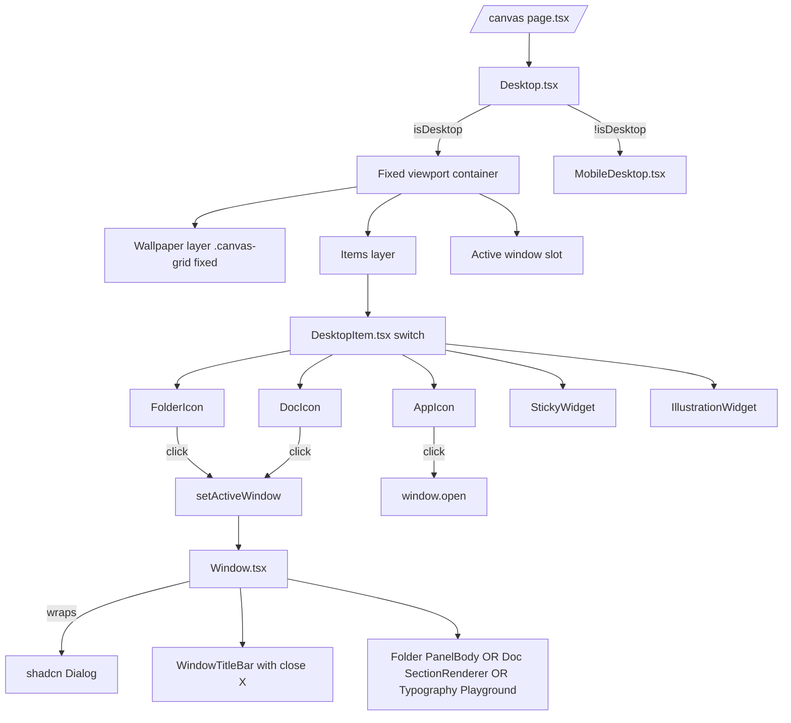
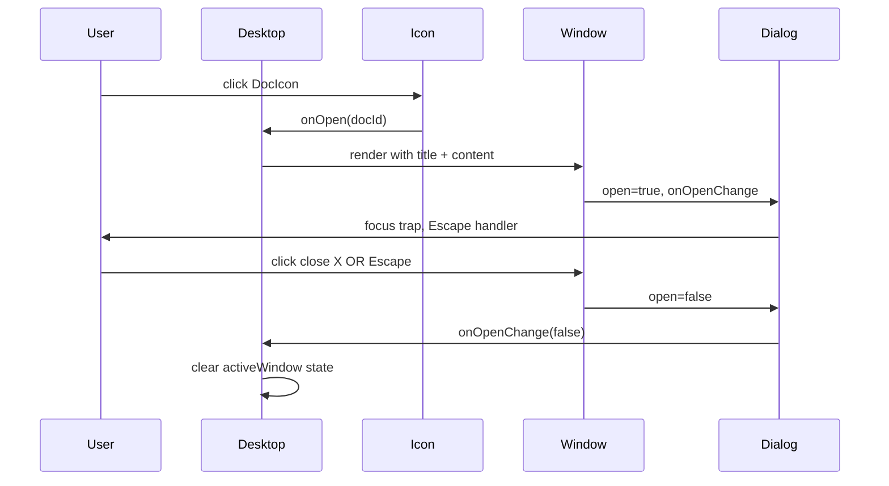

# refactor: Replace canvas with OS-style desktop interaction model

## Overview

The `/canvas` page today is a 3200×2000 freely-pannable canvas with bespoke pan/zoom/minimap/stamp-cursor chrome (~1000 LOC of canvas-only infrastructure). It works, but the metaphor is *infinite scratch space* — which fights the framing we shipped last session ("Brand Operating System"). An OS doesn't pan; an OS has a desktop.

This plan replaces the canvas with a **fixed-viewport desktop** modeled on PostHog's home page. Five element types form the new visual vocabulary:

| Type | What | Examples |
|---|---|---|
| **Folder** | Grouped resources | Colours, Illustrations, Typography, Use Cases |
| **App icon** | Real apps (open in new tab) | Icon Generator |
| **Doc icon** | One-pager docs (open in window overlay) | Manifesto, Voice & Tone, Brand Principles, Product Design Principles, About this Brand OS, Aesthetics |
| **Sticky widget** | Always-visible passive content | The 3 teacher quotes |
| **Illustration widget** | Swipeable inline illustration carousel | Replaces the 3 draggable stickers |

The bespoke canvas system (`useCanvasPan`, `Minimap`, `ZoomControls`, `EdgeVignette`, `CanvasStamp`, `CanvasSticker` drag mechanics) gets deleted — ~1000 LOC removed. The 4 modal overlays we already migrated to shadcn Dialog get a window-chrome treatment (title bar + close X) to reinforce the OS metaphor. Mobile becomes iOS-home-screen style.

This is a UX rewrite, not a content rewrite. The T&S portfolio brand framing shipped last session — manifesto copy, 4 brand principles, 7 product design principles, Kind Utility, TW Blue, Plus Jakarta Sans + Inter — is preserved verbatim.

---

## Problem Frame

We told the user this is a "Brand Operating System" but rendered it as a free-form canvas. The metaphor and the interaction don't match. A real OS has:

- A **fixed desktop** you don't scroll around to find things
- **Icons** that mean something (folders, apps, docs)
- **Widgets** for ambient content (clock, notes, weather equivalents)
- **Windows** that open when you double-click icons

Today's site has cards, modals, folders, and a pan/zoom canvas — a partial mishmash. Visitors who arrive expecting "an OS" get a Figma-like canvas instead.

**Audience priority** (unchanged from prior plan): product builders (designers, PMs) primarily; leadership and MOE stakeholders secondarily.

**User-confirmed direction** (Phase 2 of planning):
1. **Strict desktop** — kill pan/zoom; fixed viewport with icon grid
2. **Window-style overlay** for doc opening (title bar + close X)
3. **Always-visible sticky widgets** (no click; quote IS the widget)
4. **iOS home screen** for mobile (icon grid + stacked widgets)

**Reference:** https://posthog.com/ — fixed OS desktop with file-icon vocabulary and window-style opening. Specific implementation details aren't publicly inspectable, so this plan describes the metaphor in our own terms, using our existing primitives.

---

## Requirements Trace

- **R1.** The `/canvas` route renders a **fixed-viewport desktop** with no pan or zoom. Content fits within the viewport on common laptop sizes (≥1280×720); overflow is handled by vertical scroll only, not pan.
- **R2.** Every interactive item on the desktop falls into one of five element types: **Folder, App icon, Doc icon, Sticky widget, Illustration widget**. No item types outside this vocabulary.
- **R3.** Doc icons open in a **window-style overlay** (title bar with doc name + close X) — same shadcn Dialog primitive underneath, restyled with window chrome.
- **R4.** App icons open the linked URL in a **new browser tab** (cheap, standard OS behavior for external apps).
- **R5.** Sticky widgets show their content **always-visible on the desktop**, no click required. No QuoteModal.
- **R6.** Illustration widgets render an **inline swipeable carousel** embedded on the desktop. No popup-on-click for the illustrations.
- **R7.** The bespoke canvas chrome — `useCanvasPan`, `Minimap`, `ZoomControls`, `EdgeVignette`, `CanvasStamp`, and the drag mechanics of `CanvasSticker` — is **deleted** (~1000 LOC). The free-form canvas no longer exists.
- **R8.** Mobile (<1024px) renders an **iOS-home-screen-style layout**: 3–4 column icon grid for folders/apps/docs at top, sticky and illustration widgets stacked vertically below. Replaces the existing `StackLayout`.
- **R9.** All existing T&S brand content (manifesto copy, 4 brand principles, 7 product design principles, Colours/Illustrations/Typography/Use Cases panels, Tools content) ships unchanged in copy and intent. Only the interaction model around it changes.
- **R10.** The Hero typography playground (`HeroText.tsx`, 761 LOC) gets repackaged as a **"Typography Playground" doc icon** — click opens it in a window. Not deleted; the playground content is preserved.
- **R11.** Visual identity preserved: Teacher & School Blue (#0064FF), Plus Jakarta Sans + Inter, shadcn primitives, Kind Utility tone.
- **R12.** A11y posture maintained: every icon is keyboard-reachable, focus rings visible, window-overlay focus trap + Escape + focus restore preserved from shadcn Dialog.

---

## Scope Boundaries

- Not adding **window management** beyond single-window-at-a-time. No multi-window z-order, no drag-windows-around, no minimize/maximize. The user's session noted: "single modal at a time" is the default.
- Not adding a **dock or taskbar**. PostHog has a dock; we don't — adds significant complexity for marginal payoff given the icon grid is the primary nav. Reserved as a future enhancement.
- Not building **draggable desktop icons** in v1. Icon positions are author-defined in data, not user-adjustable. (Could be a v2 enhancement.)
- Not adding **wallpaper customization** or themes. Single wallpaper treatment; brand-appropriate (subtle TW Blue-tinted dot grid using the existing `canvas-grid` CSS pattern, made fixed instead of pannable).
- Not changing the **home page (`/`)** — manifesto card, CTA, layout metadata all stay. Only `/canvas` is rewritten.
- Not migrating any **tooling** (no shadcn add of new primitives, no new dependencies beyond what's already installed). Existing Button/Card/Dialog cover the new components.
- Not migrating **PanelBody renderers** (the content-block renderers for color-swatch, asset-list, tool-list, etc.) — these are inside windows now but their internal layout is unchanged.
- Not deleting **content data** in `panel-contents.ts` / `modal-contents.ts` / `portfolio.ts`. Content sources of truth are preserved; only the *items* in `canvas-items.ts` get rewritten as `desktop-items.ts`.

### Deferred to Follow-Up Work

- Dock / taskbar — if user testing shows people miss it, add as a separate unit
- Draggable icons + persistent layout (localStorage) — v2 enhancement
- Window minimize/maximize / multi-window — v2 enhancement
- Themed wallpapers (light/dark, alternate brand treatments) — separate small plan
- Removing the now-unused `ImageCard.tsx` (already orphaned by prior plan's photo removal) — could fold into U13 cleanup if convenient

---

## Context & Research

### Relevant Code and Patterns

- `src/components/canvas/CanvasViewport.tsx` (261 LOC) — current orchestrator. Drives pan/zoom, sticker state, overlay state, item routing. Most of this gets deleted; what survives becomes `Desktop.tsx` orchestrating fixed-viewport items + windows.
- `src/components/canvas/CanvasLayout.tsx` (181 LOC) — current item renderer. The `CanvasItem` discriminated union routing pattern survives; what it routes to changes.
- `src/components/canvas/CanvasItem.tsx` (133 LOC) — the per-item renderer switch. Same shape; new cases.
- `src/components/canvas/StackLayout.tsx` (39 LOC) — current mobile fallback. Gets rewritten as `MobileDesktop.tsx` with iOS-grid + stacked-widgets layout.
- `src/data/canvas-items.ts` — current data source. Gets rewritten to use new element types (folder / app / doc / sticky / illustration-widget).
- `src/types/canvas.ts` — discriminated union type. Gets new variants matching the 5 element types.
- `src/components/items/BrandCard.tsx` — the current "doc preview on canvas" component. Becomes obsolete or shrinks into `DocIcon`.
- `src/components/items/QuoteCard.tsx` — currently has preview + QuoteModal. The QuoteModal portion deletes; preview becomes `StickyWidget`.
- `src/components/items/IllustrationReel.tsx` + `src/components/items/IllustrationPopup.tsx` — preview opens popup today. Becomes `IllustrationWidget` (inline carousel, no popup).
- `src/components/items/HeroText.tsx` (761 LOC) — the typography playground. Currently on canvas; becomes the content of a "Typography Playground" doc that opens in a window.
- `src/components/items/FolderIcon.tsx` — already exists; restyle to fit new icon vocabulary (likely smaller/cleaner; consistent with App icon and Doc icon).
- `src/components/ui/dialog.tsx` — shadcn Dialog. Becomes the foundation for the window primitive (add title bar + restyle close X as a window control).
- `src/components/panel/FolderModal.tsx` and `src/components/cards/CardModal.tsx` — current overlay sites. Become window-style overlays.
- `src/components/icons/index.ts` — icon barrel. Add new icons for app launchers and OS chrome (e.g., lucide `Folder`, `FileText` if used).
- `src/app/globals.css` — `.canvas-grid` and `.canvas-inner` rules survive but get re-purposed for a fixed wallpaper. The `cursor: none` + stamp cursor CSS rules get deleted alongside `CanvasStamp`.

### Institutional Learnings

- `docs/plans/2026-06-02-001-refactor-shadcn-base-ui-migration-plan.md` (completed) — shipped the shadcn/Base UI primitives (Button, Card, Dialog) this plan reuses.
- `docs/plans/2026-06-03-001-feat-ts-portfolio-brand-os-plan.md` (completed) — shipped the T&S portfolio brand framing and the tool-list panel item. Adding new panel item types follows the same pattern.
- Prior session's QuoteCard precedent (preview kept card-less per editorial intent) established: when planned visual treatment conflicts with brand identity, brand wins. Applies here — if a sticky widget design loses the editorial typography, fall back to text-only.

### External References

- https://posthog.com/ — the user-named reference. Static HTML inspection couldn't expose interaction details, so this plan describes the OS metaphor in our own terms rather than copying PostHog's specifics. The four product decisions in Phase 2 anchored the architecture.

---

## Key Technical Decisions

- **Fixed-viewport desktop replaces pannable canvas.** All `useCanvasPan` orchestration is removed. The `Desktop.tsx` component renders into a `fixed inset-0` container at viewport size; items are positioned within that fixed area (absolute positioning by % or grid placement, not by absolute pixel coordinates on a 3200×2000 plane).
- **5-element type taxonomy is the new data shape.** `DesktopItem` discriminated union: `FolderDesktopItem | AppDesktopItem | DocDesktopItem | StickyDesktopItem | IllustrationWidgetDesktopItem`. No other types. `BrandCard`'s default + featured variants disappear from canvas authoring; the featured variant chrome (the BrandCard featured Button variant) survives for the homepage CTA where it's actually used.
- **Window primitive = shadcn Dialog + window chrome.** Build a `<Window>` component that wraps `<Dialog>` with: a `<WindowTitleBar>` showing the doc title and an OS-style close X (positioned top-right with a tinted hover area). Doc opening reuses everything we already shipped for accessibility (focus trap, Escape, scroll lock).
- **App icon = `<a target="_blank">` styled as a desktop icon.** No special "app launcher" logic. The OS metaphor is visual, not behavioral; clicking an app icon opens a new browser tab. The external-link affordance (lucide `ExternalLink`) appears as a subtle badge on the icon.
- **Sticky widget = passive display.** The current `QuoteCard` preview shape becomes the widget; the `QuoteModal` overlay is deleted entirely. If a quote is too long to fit in the sticky size, truncate gracefully or split into smaller stickies — content-time decision.
- **Illustration widget = inline carousel using existing Motion.** Reuses the Motion library already in the project. Swipe via touch (mobile) and prev/next buttons (desktop). Replaces the current "click sticker → drag" pattern. The 3 existing sticker illustrations become slides in one widget.
- **Typography playground becomes a Doc icon.** Click "Typography Playground" doc → opens a wide window with the existing `HeroText` playground inside. Preserves the 761 LOC of work and makes it reachable in the new metaphor.
- **No new dependencies.** Everything ships using shadcn Button/Card/Dialog, Motion, lucide-react, and the design tokens already in `globals.css`.
- **Mobile = iOS-home-screen-style.** Below 1024px breakpoint, render `MobileDesktop.tsx`: 3-column icon grid (folders/apps/docs, square tiles 28% width each, gap-3), then sticky widgets stacked vertically, then the illustration widget at the bottom. Replaces existing `StackLayout`.
- **Wallpaper = subtle TW Blue-tinted dot grid.** Reuse the existing `.canvas-grid` CSS, but make it fixed (not pannable). Add a very subtle `--accent-light` tint over the surface for warmth. The current dot grid pattern was already brand-appropriate.
- **CSS variable cleanup.** `--canvas-grid`, `--canvas-bg`, `--minimap-*`, `--folder-icon-*` survive (still used). `--cursor-glow-radius`, `--cursor-x`, `--cursor-y`, the `.canvas-inner` cursor rules, and the `@keyframes stamp-appear` block get deleted with `CanvasStamp`.

---

## Open Questions

### Resolved During Planning

- **OS metaphor strictness:** Strict desktop. Kill pan/zoom; fixed viewport with icon grid.
- **Doc open behavior:** Window-style overlay (title bar + close X).
- **Sticky widget behavior:** Always-visible passive content; delete QuoteModal.
- **Mobile fallback:** iOS-home-screen-style icon grid + stacked widgets below.
- **App icon click behavior:** Open in new tab. Standard OS app-launch behavior for external links; no embedded preview.
- **Wallpaper treatment:** Reuse existing dot grid, fixed (not pannable), with subtle `--accent-light` tint. No dark/light themes.
- **Window management complexity:** Single window at a time. No drag, resize, minimize, multi-window stacking.
- **Dock / taskbar:** None. Reserved for future enhancement if user testing shows it's missed.
- **Hero typography playground fate:** Becomes a Doc icon ("Typography Playground"). Opens in a wide window with the playground inside.
- **Manifesto placement:** Doc icon. Manifesto card on home (`/`) stays; on `/canvas` it becomes a featured Doc icon (pinned top-left or similar — implementation-time choice).
- **What replaces the `BrandCard` featured variant on the canvas:** The featured variant survives in the Button config (still used by the homepage's "Why Aesthetics matters?" element? Verify in U9). On the desktop, all docs use the same Doc icon shape; no featured/default distinction.

### Deferred to Implementation

- **Exact desktop layout grid.** Where each icon goes — 3-col grid top-left? Mosaic? Auto-flow? Resolve at U9 by sketching on the actual viewport and adjusting positions until it reads well. The plan dictates *which icons exist*, not where they sit pixel-precisely.
- **Window title bar visual treatment.** OS-style traffic-light buttons (red/yellow/green) vs single close X vs minimal chrome. Try the simplest (single close X with title) at U8; escalate to fuller chrome only if it feels visually thin.
- **Sticky widget styling.** Yellow Post-it skeumorphism (matches `--quote-highlight: #FFE066` token currently unused) vs TW-Blue-tinted card vs neutral white card. Resolve at U6 by trying all three and picking what reads as both editorial and on-brand.
- **Illustration widget UX.** Auto-advance every N seconds vs strictly user-driven swipe. Default to user-driven; revisit only if illustrations feel too static.
- **Whether to keep `StampCursor` as a desktop "delight" element.** Plan default: delete with the rest of the canvas chrome (no longer fits the metaphor). If the user objects post-implementation, revive as a desktop click effect (a single sound or ripple, not a persistent stamp).
- **Window animation entry/exit.** Slide-in from below, scale-up from center, fade — pick what feels most "OS app launching." Currently shadcn Dialog fades + zooms; that's fine; revisit if it feels off after U8.
- **Whether to add a "Brand OS" title bar at the top of the desktop** (PostHog-style menu bar). Plan default: no; can add as a small follow-on if needed.

---

## Output Structure

This plan adds new components and rewrites two key surfaces (`Desktop` replaces `CanvasViewport`; `MobileDesktop` replaces `StackLayout`). It deletes ~1000 LOC of bespoke canvas chrome.

    src/
    ├── app/
    │   └── canvas/
    │       └── page.tsx                          # MODIFY — renders Desktop instead of CanvasViewport
    ├── components/
    │   ├── desktop/                              # NEW DIR — replaces canvas/
    │   │   ├── Desktop.tsx                       # NEW — orchestrator; replaces CanvasViewport
    │   │   ├── DesktopItem.tsx                   # NEW — per-item renderer switch; replaces CanvasItem
    │   │   ├── MobileDesktop.tsx                 # NEW — iOS-home-screen layout for mobile; replaces StackLayout
    │   │   ├── icons/
    │   │   │   ├── FolderIcon.tsx                # MOVE — relocated from items/
    │   │   │   ├── AppIcon.tsx                   # NEW
    │   │   │   └── DocIcon.tsx                   # NEW
    │   │   ├── widgets/
    │   │   │   ├── StickyWidget.tsx              # NEW — replaces QuoteCard preview + QuoteModal
    │   │   │   └── IllustrationWidget.tsx        # NEW — inline carousel; replaces stickers + IllustrationPopup
    │   │   └── Window.tsx                        # NEW — shadcn Dialog + title bar + close X
    │   ├── canvas/                               # DELETE entire directory (after Desktop is in place)
    │   │   ├── CanvasViewport.tsx                # DELETE
    │   │   ├── CanvasLayout.tsx                  # DELETE
    │   │   ├── CanvasItem.tsx                    # DELETE
    │   │   ├── CanvasStamp.tsx                   # DELETE
    │   │   ├── CanvasSticker.tsx                 # DELETE
    │   │   ├── EdgeVignette.tsx                  # DELETE
    │   │   ├── StackLayout.tsx                   # DELETE
    │   │   └── ZoomControls.tsx                  # DELETE
    │   ├── minimap/                              # DELETE entire directory
    │   │   └── Minimap.tsx                       # DELETE
    │   └── items/
    │       ├── BrandCard.tsx                     # KEEP — featured variant still used by home CTA; default variant unused on canvas (consider whether to delete in U13)
    │       ├── HeroText.tsx                      # KEEP — becomes Typography Playground doc content
    │       ├── IllustrationPopup.tsx             # DELETE — replaced by inline IllustrationWidget
    │       ├── IllustrationReel.tsx              # DELETE — replaced by IllustrationWidget
    │       ├── QuoteCard.tsx                     # DELETE — replaced by StickyWidget
    │       ├── FolderIcon.tsx                    # MOVE to desktop/icons/
    │       ├── ImageCard.tsx                     # DELETE — already orphaned by prior plan
    │       ├── ManifestoCard.tsx                 # DELETE — was a canvas-only component (no longer referenced after U9)
    │       ├── PillarCard.tsx                    # DELETE — same
    │       ├── TextCard.tsx                      # DELETE — same
    │       ├── UtilityCard.tsx                   # DELETE — same
    │       └── GlowCard.tsx                      # DELETE — cursor-tracking effect only made sense in a free-form canvas
    ├── hooks/
    │   ├── useCanvasPan.ts                       # DELETE
    │   ├── useCursorPosition.ts                  # DELETE — was used only by CanvasStamp glow effect
    │   └── useMediaQuery.ts                      # KEEP — used by Desktop to choose between Desktop and MobileDesktop
    ├── data/
    │   ├── canvas-items.ts                       # REPLACE — becomes desktop-items.ts with new element types
    │   ├── stickers.ts                           # CONSOLIDATE — the 3 stickers become slides in IllustrationWidget data
    │   └── portfolio.ts                          # UNCHANGED
    ├── types/
    │   ├── canvas.ts                             # REPLACE — becomes desktop.ts with DesktopItem union
    │   └── panel.ts, modal.ts, portfolio.ts      # UNCHANGED
    └── app/
        └── globals.css                           # PRUNE — delete stamp-appear keyframes, cursor: none rules, .canvas-inner::after, --cursor-* vars, --minimap-* vars

---

## High-Level Technical Design

> *This illustrates the intended approach and is directional guidance for review, not implementation specification. The implementing agent should treat it as context, not code to reproduce.*

### Data shape (new `DesktopItem` discriminated union)

```
type DesktopItem =
  | { type: "folder";              id; label; panelId;                position?; mobileOrder }
  | { type: "app";                  id; label; iconColor; iconGlyph; href; mobileOrder }
  | { type: "doc";                  id; label; iconColor?; modalId;    position?; mobileOrder }
  | { type: "sticky";               id; quote; highlight?; attribution; rotation?; position?; mobileOrder }
  | { type: "illustration-widget";  id; slides: IllustrationSlide[];   position?; mobileOrder }
```

Positions on desktop are CSS percentages or grid cells (not absolute 3200×2000 coords). Mobile order drives stacking on `MobileDesktop`.

### Component tree (post-refactor)



### Interaction flow



---

## Implementation Units

### Phase 1 — Delete the canvas (foundation by subtraction)

- U1. **Delete bespoke canvas chrome and pan/zoom infrastructure**

**Goal:** Remove the entire free-form canvas system: pan/zoom hook, minimap, zoom controls, edge vignette, stamp cursor, sticker drag mechanics. Leaves `/canvas` temporarily broken so U2 must follow immediately.

**Requirements:** R1, R7

**Dependencies:** None

**Files:**
- Delete: `src/hooks/useCanvasPan.ts`
- Delete: `src/hooks/useCursorPosition.ts`
- Delete: `src/components/canvas/CanvasStamp.tsx`
- Delete: `src/components/canvas/CanvasSticker.tsx`
- Delete: `src/components/canvas/EdgeVignette.tsx`
- Delete: `src/components/canvas/ZoomControls.tsx`
- Delete: `src/components/minimap/Minimap.tsx` (then `rmdir` the directory)
- Modify: `src/app/globals.css` (delete `@keyframes stamp-appear`, `.canvas-inner::after` rules, `cursor: none`, `--cursor-*` vars, `--minimap-*` vars)

**Approach:**
- Mass delete; this work cannot land as a clean atomic commit if we try to keep the canvas working in between. U1 + U2 must be a tight sequence; if execution is interrupted between them the tree won't build.
- Some files in `src/components/canvas/` survive temporarily (`CanvasViewport`, `CanvasLayout`, `CanvasItem`, `StackLayout`) — they're deleted in U2 when their replacement lands.

**Patterns to follow:**
- The previous refactor's U21 (`.canvas-card` deletion) is the precedent for "delete supporting CSS alongside the component."

**Test scenarios:**
- Test expectation: none — this is a pure deletion unit. Build will break temporarily; verification happens in U2.

**Verification:**
- All listed files removed from disk
- Grep returns zero references to deleted symbols outside the doomed-but-not-yet-deleted `CanvasViewport`

---

- U2. **Build `Desktop.tsx` scaffold + new `DesktopItem` data shape**

**Goal:** Replace `CanvasViewport` and `CanvasLayout` with a fixed-viewport `Desktop` component. Replace `CanvasItem` discriminated union with `DesktopItem`. Render a placeholder for each item type so the page builds and items show on screen (even if the per-element components don't exist yet).

**Requirements:** R1, R2, R7

**Dependencies:** U1

**Files:**
- Create: `src/components/desktop/Desktop.tsx`
- Create: `src/components/desktop/DesktopItem.tsx` (per-item renderer switch with placeholders)
- Create: `src/types/desktop.ts` (DesktopItem union; replaces canvas.ts shape)
- Create: `src/data/desktop-items.ts` (new items list using DesktopItem shape; populated with the migrated content but rendering as placeholders for now)
- Modify: `src/app/canvas/page.tsx` (renders `<Desktop />` instead of `<CanvasViewport />`)
- Delete: `src/components/canvas/CanvasViewport.tsx`
- Delete: `src/components/canvas/CanvasLayout.tsx`
- Delete: `src/components/canvas/CanvasItem.tsx`
- Delete: `src/types/canvas.ts` (after migration)
- Delete: `src/data/canvas-items.ts` (after migration)

**Approach:**
- `Desktop.tsx` is a `fixed inset-0` container with the existing dot-grid background as wallpaper (no pan, no zoom). It maps over `desktopItems` and routes each to `DesktopItem.tsx`.
- `DesktopItem.tsx` is a switch on `item.type`; for U2 each case renders a simple `<div>` placeholder with the item's label so positions can be visually verified. Real renderers land in U3–U7.
- Use `useMediaQuery` (the surviving hook) to render `MobileDesktop` instead when `isDesktop === false`. Stub `MobileDesktop.tsx` for U2 (it gets fleshed out in U10).
- Positioning convention: items use `position: { x: number, y: number }` where x and y are percentages of viewport (0–100). Document this in `types/desktop.ts`.
- Wallpaper: reuse `.canvas-grid` CSS class but apply to the fixed container (not the inner pan plane).

**Patterns to follow:**
- `src/components/canvas/CanvasViewport.tsx`'s `useMediaQuery` + StackLayout branching pattern survives in spirit.
- `src/components/canvas/CanvasItem.tsx`'s switch on `item.type` survives in spirit.

**Test scenarios:**
- Happy path: visiting `/canvas` renders the new `Desktop` with all items as placeholders; no pan, no zoom; build is clean
- Happy path: switching viewport from desktop to mobile (≥/<1024px breakpoint) swaps between Desktop and MobileDesktop renderers
- Edge case: empty `desktopItems` array renders the wallpaper alone without error

**Verification:**
- `npm run build` clean
- `/canvas` returns 200; visible items are placeholders (text labels) at approximately their intended positions
- Browser DevTools confirm no `useCanvasPan` references remain; no pan/zoom event listeners

---

### Phase 2 — Build the 5 element renderers (parallel-safe after U2)

- U3. **`DocIcon` — clickable desktop icon that opens a window**

**Goal:** Build the doc icon visual + click-to-open behavior. Replaces the BrandCard preview pattern. Used by 6 surfaces (Manifesto, Voice & Tone, Brand Principles, Product Design Principles, About this Brand OS, Aesthetics) plus the Typography Playground.

**Requirements:** R2, R3

**Dependencies:** U2, U8 (Window primitive)

**Files:**
- Create: `src/components/desktop/icons/DocIcon.tsx`

**Approach:**
- Visual: rounded-square tile (similar shape to product logo lockups from the user's earlier image), brand-tinted background (`bg-card-bg` with `border-card-border`), lucide `FileText` or similar glyph centered, doc label below the tile in small text.
- Interaction: single click opens; double-click feels OS-y but is awkward on web. Single-click + visible focus ring is the standard.
- Wired to: parent `Desktop` state (`activeWindow`); clicking calls `onOpen(docId)`.
- A11y: button element, aria-label includes the doc title, focus-visible ring using existing `--accent` token.
- Default tile size: 88×88 with ~32px glyph; label up to 2 lines below. Consistent with FolderIcon and AppIcon sizing for visual rhythm.

**Patterns to follow:**
- Existing `FolderIcon.tsx` for size/spacing rhythm; reuse the motion `whileHover`/`whileTap` micro-interaction.
- shadcn Button focus-visible pattern.

**Test scenarios:**
- Happy path: clicking a doc icon opens the corresponding window with title + content
- Happy path: keyboard tab reaches the icon, Enter opens the window, focus returns to the icon when window closes
- Edge case: doc icon with no glyph specified renders a default placeholder glyph

**Verification:**
- Each of the 6 doc icons (rendered post-U9) opens its window with the right content
- Tab order is sensible

---

- U4. **`AppIcon` — clickable desktop icon that opens an external URL in a new tab**

**Goal:** Build the app icon. Used for tools like Icon Generator that live in external repos.

**Requirements:** R2, R4

**Dependencies:** U2

**Files:**
- Create: `src/components/desktop/icons/AppIcon.tsx`

**Approach:**
- Visual: rounded-square tile (like DocIcon shape), brand-colored background, app glyph centered. Distinguishes from docs via a subtle external-link badge (lucide `ExternalLink` in a small corner overlay) to signal "this opens elsewhere."
- Interaction: renders as `<a href target="_blank" rel="noopener noreferrer">` styled as an icon. Single click → new tab.
- A11y: aria-label includes "(opens in new tab)".

**Patterns to follow:**
- `src/components/icons/index.ts` already exports `ExternalLink` from lucide (added in U7 of prior plan).
- The Tools panel's `tool-list` renderer (shipped in prior fix) used the same pattern of `Open` button + ExternalLink glyph.

**Test scenarios:**
- Happy path: clicking the Icon Generator app icon opens the GitHub repo in a new tab
- Edge case: outbound link has correct `rel="noopener noreferrer"` (verify in DOM)
- A11y: aria-label communicates external-link behavior to screen readers

**Verification:**
- Icon Generator app icon is visible on desktop, clickable, opens repo in new tab

---

- U5. **`FolderIcon` — restyle and relocate**

**Goal:** Keep the existing FolderIcon but relocate it to the new directory and ensure it visually matches the DocIcon/AppIcon vocabulary.

**Requirements:** R2

**Dependencies:** U2, U8

**Files:**
- Create: `src/components/desktop/icons/FolderIcon.tsx` (relocated from `src/components/items/FolderIcon.tsx`)
- Modify: import paths in any consumer
- Delete: `src/components/items/FolderIcon.tsx` after relocation

**Approach:**
- The existing component (uses `FolderMark` from the icon barrel) is already close to the right shape. Restyle if needed for size consistency with DocIcon and AppIcon (same tile dimensions; same label treatment).
- Click behavior: same as DocIcon (opens window with the folder's panel content).

**Patterns to follow:**
- Existing `FolderIcon.tsx` — minimal restyle needed.

**Test scenarios:**
- Happy path: clicking a folder icon opens its panel in a window (Colours / Illustrations / Typography / Use Cases / Tools)
- Edge case: visually consistent sizing with DocIcon and AppIcon on the desktop grid

**Verification:**
- All 5 folder icons render at consistent size
- Click opens the corresponding panel window

---

- U6. **`StickyWidget` — always-visible passive quote display**

**Goal:** Build the sticky widget. Always visible on the desktop; no click-to-expand. Replaces `QuoteCard` preview + the now-deleted `QuoteModal`.

**Requirements:** R2, R5

**Dependencies:** U2

**Files:**
- Create: `src/components/desktop/widgets/StickyWidget.tsx`
- Delete: `src/components/items/QuoteCard.tsx` (after U9 confirms no references)

**Approach:**
- Visual: post-it / sticky note styling. Try three treatments (decide at implementation per deferred questions): (a) yellow `--quote-highlight` background with soft shadow, (b) TW-Blue-tinted card, (c) neutral white card with editorial typography. Default to (a) — uses the currently-unused `--quote-highlight: #FFE066` token.
- Content: full quote text (no truncation; size sticky to fit), highlight span if present, attribution in smaller text below.
- Rotation: slight pseudo-random rotation per sticky (1–3 degrees) for natural look, defined per-item.
- Size: ~280×200 default; per-item override if needed.
- No interaction state — purely passive. No hover lift, no click.

**Patterns to follow:**
- Existing `QuoteCard` preview's typography choices (`font-display`, blockquote shape) survive; the chrome around them changes from "interactive card" to "sticky note."

**Test scenarios:**
- Happy path: 3 sticky widgets render with the 3 existing teacher quotes, each with attribution
- Happy path: highlight spans render with `--quote-highlight` mark styling
- Edge case: missing attribution still renders cleanly (no orphan formatting)
- A11y: blockquote semantics preserved; not focusable (passive content)

**Verification:**
- 3 stickies visible on the desktop with the existing quote content
- No QuoteModal open path remaining; clicking the sticky does nothing (intended)

---

- U7. **`IllustrationWidget` — inline swipeable illustration carousel**

**Goal:** Build the illustration widget. Replaces the 3 draggable stickers + the `IllustrationPopup` modal. Inline carousel that lets users browse illustrations directly on the desktop.

**Requirements:** R2, R6

**Dependencies:** U2

**Files:**
- Create: `src/components/desktop/widgets/IllustrationWidget.tsx`
- Delete: `src/components/items/IllustrationReel.tsx`
- Delete: `src/components/items/IllustrationPopup.tsx`

**Approach:**
- Visual: a single widget on the desktop showing one illustration at a time. Prev/Next buttons (lucide ChevronLeft/Right). Touch swipe enabled (use Motion's drag API for the swipe gesture).
- Slides: the 3 existing sticker illustrations from `src/data/stickers.ts` (search, together, focus) become the initial slides. Slide shape: `{ id, caption, imageSrc, alt }`.
- Auto-advance: default OFF (user-driven only; per deferred decision). Easy to add later if static feel doesn't work.
- Dot indicator below illustration shows position in carousel.
- Size: ~360×280 (illustration + caption row).

**Patterns to follow:**
- Existing `IllustrationPopup` had nav arrows + dot indicators — port the visual treatment.
- Motion's `useDragControls` for swipe (if Motion supports it; otherwise simple touch-event handlers).

**Test scenarios:**
- Happy path: widget renders the first illustration; clicking Next advances; arrow keys do too
- Happy path: dot indicator highlights the active slide
- Happy path: swipe (mouse drag or touch) advances/retreats slides on touch devices
- Edge case: a single-slide widget hides nav arrows and dots
- Edge case: looping — Next on last slide wraps to first
- A11y: arrow buttons keyboard-reachable; aria-live="polite" announces slide changes

**Verification:**
- One IllustrationWidget on the desktop showing the 3 existing sticker illustrations as slides
- Swipe + arrow nav both work
- No IllustrationPopup or sticker drag remaining

---

- U8. **`Window` — shadcn Dialog wrapped with OS-style title bar + close X**

**Goal:** Build the window primitive that all doc and folder opens use. Wraps the existing shadcn Dialog (preserves all a11y) and adds a title bar with the doc/folder name + close X positioned as window chrome.

**Requirements:** R3, R12

**Dependencies:** None (shadcn Dialog exists)

**Files:**
- Create: `src/components/desktop/Window.tsx`

**Approach:**
- Composition: `Window` wraps `Dialog` + `DialogContent`. Renders a fixed title bar at the top of the DialogContent (with the doc title and an OS-style close X — single button, no traffic-light theatre per deferred decision). Content slot fills the rest.
- Title bar styling: shorter than the existing `CardModal` header. ~40px tall, subtle border-bottom, the close X at top-right inside the title bar (not floating in the corner like the current modal close).
- Reuse the prior plan's modal scroll fix: `max-h-[90vh] overflow-y-auto` to handle tall content.
- Animation: rely on shadcn Dialog's default fade+zoom for now; revisit if it doesn't feel OS-app-launch-like.
- Consumers: `FolderModal` and `CardModal` (the renamings of which to `FolderWindow` / `DocWindow` happens in U9) wrap their content with `<Window title="…">…</Window>`.

**Patterns to follow:**
- Current `FolderModal.tsx` and `CardModal.tsx` shape — title + thin separator + body — already exists. The `Window` just formalizes it as a reusable primitive with explicit title-bar semantics.

**Test scenarios:**
- Happy path: window renders with title bar showing the passed title and a working close X
- Happy path: Escape closes window; focus returns to the trigger icon
- Edge case: very long titles truncate with ellipsis (not wrap to multiple lines)
- A11y: aria-labelledby points to the title bar text; focus trap works

**Verification:**
- Wrapping any content in `<Window title="Test">…</Window>` produces an OS-app-window-shaped overlay with title + close X + scrollable body

---

### Phase 3 — Content migration & mobile

- U9. **Migrate canvas-items.ts content into desktop-items.ts and wire up renderers**

**Goal:** Take all current content (6 brand cards → 6 doc icons, 5 folders → 5 folder icons, 1 implicit Tools doc icon for the icon-generator, 3 quotes → 3 sticky widgets, 3 stickers → 1 illustration widget, hero playground → 1 "Typography Playground" doc) and author it in the new desktop-items shape. Replace `DesktopItem` placeholders (from U2) with the real per-element renderers from U3–U8.

**Requirements:** R2, R9, R10

**Dependencies:** U3, U4, U5, U6, U7, U8

**Files:**
- Modify: `src/data/desktop-items.ts` (full content authoring)
- Modify: `src/components/desktop/DesktopItem.tsx` (switch wired to real renderers, not placeholders)
- Delete: `src/data/stickers.ts` (data consolidated into the illustration widget item in desktop-items.ts)
- Modify: `src/data/portfolio.ts` if the Icon Generator promoted out of the Tools panel needs to be referenced separately (decide at implementation; can stay in portfolio.ts as the source of truth)
- Delete: `src/components/items/BrandCard.tsx` if the featured variant turns out not to be used anywhere post-migration (verify in this unit; current usage is the homepage CTA — confirm whether the homepage uses `<Button variant="featured">` directly or via BrandCard)
- Delete: `src/components/items/ManifestoCard.tsx`, `PillarCard.tsx`, `TextCard.tsx`, `UtilityCard.tsx` (these were canvas-only components, no longer referenced after migration)
- Delete: `src/components/items/GlowCard.tsx` (cursor-tracking effect — no place in fixed desktop)

**Approach:**
- Define each item with the new shape:
  - Doc icons: Manifesto, Voice & Tone, Brand Principles, Product Design Principles, About this Brand OS, Aesthetics, Typography Playground
  - Folder icons: Colours, Illustrations, Typography (the panel — distinct from the Playground doc), Use Cases, Tools
  - App icons: Icon Generator (pulled from `portfolio.ts`)
  - Sticky widgets: 3 quotes
  - Illustration widget: 1 widget with 3 slides (search/together/focus)
- The Typography Playground doc → its window contents render `<HeroText />` (or whatever surviving subset of the playground). HeroText itself stays in `src/components/items/` for now; consider moving to `src/components/playground/` in U13 cleanup if it lives in its own concept space.
- The Tools folder is interesting: does it stay as a folder containing the tool-list panel, or do tools become first-class app icons on the desktop? Default: with only 1 tool today (Icon Generator), promote it directly as an app icon on the desktop. If more tools come, we can re-introduce the folder. Document this decision in the data file.
- Position each item using viewport-relative coordinates. Author a sensible default layout (icons on left, widgets on right; Manifesto prominent top-left). Refine at implementation by visual judgment.

**Patterns to follow:**
- The previous plan's data-driven approach (portfolio.ts → tools panel) is the precedent for sourcing item content from a single data module.

**Test scenarios:**
- Happy path: every doc icon opens its corresponding window with the right modal content (Manifesto opens Manifesto, etc.)
- Happy path: every folder icon opens its panel
- Happy path: clicking the Icon Generator app icon opens the GitHub repo in a new tab
- Happy path: 3 stickies + 1 illustration widget render
- Edge case: items overflow the viewport on common laptop sizes — verify default layout fits at ≥1280×720
- Edge case: no item is unreachable by keyboard (Tab cycles through all icons + widget arrows)

**Verification:**
- All current content surfaces are reachable in the new desktop
- No item type other than the 5 defined exists
- Build clean; routes return 200; manual smoke test confirms each item opens or displays its content

---

- U10. **`MobileDesktop.tsx` — iOS-home-screen layout**

**Goal:** Replace the stub MobileDesktop from U2 with the real layout: 3-column icon grid (folders, apps, docs) at top; sticky widgets stacked vertically below; illustration widget at bottom.

**Requirements:** R8

**Dependencies:** U9

**Files:**
- Modify: `src/components/desktop/MobileDesktop.tsx`
- Delete: `src/components/canvas/StackLayout.tsx`

**Approach:**
- Top zone: icons in a 3-column grid using CSS Grid. Folders + Apps + Docs intermixed by `mobileOrder`. Square tiles (each ~28% of viewport width, gap-3). Tap-target ≥44px.
- Middle zone: sticky widgets in a single column, padding around each.
- Bottom zone: illustration widget at full width.
- Window opening on mobile reuses the same shadcn Dialog primitive (full-screen on mobile via existing Dialog responsive behavior).
- Hero typography playground on mobile: the playground itself is unwieldy on a phone; render the Typography Playground doc icon as usual but the opened window shows a "best viewed on desktop" message + a static type-scale display instead of the interactive playground. Document this trade-off in the file.

**Patterns to follow:**
- Existing `StackLayout.tsx` — the mobile-order sorting pattern.
- Tailwind v4 grid utilities; shadcn primitives.

**Test scenarios:**
- Happy path: at <1024px, MobileDesktop renders icons in a 3-col grid
- Happy path: tap on an icon opens its window in a mobile-friendly overlay
- Happy path: sticky widgets visible below icons; illustration widget at bottom
- Edge case: very narrow viewports (<360px) still render readably
- Edge case: landscape mobile (≥768 width) — grid expands to 4 cols
- A11y: tap targets ≥44px

**Verification:**
- Mobile preview on `/canvas` shows the iOS-home-screen layout
- All items reachable; windows open and close cleanly
- No horizontal scroll

---

### Phase 4 — Cleanup & docs

- U11. **Prune unused CSS, delete orphaned components, update icon barrel**

**Goal:** After U9 + U10 land, sweep for dead code: globals.css rules tied to deleted canvas chrome, components no longer imported anywhere, icon exports no longer used.

**Requirements:** R7

**Dependencies:** U9, U10

**Files:**
- Modify: `src/app/globals.css`
- Modify: `src/components/icons/index.ts` (drop any unused icon re-exports; verify which are still used)
- Delete: any items/* component still orphaned after the migration (run grep to confirm)
- Delete: `src/data/stickers.ts` (if not already in U9)
- Delete: `src/types/canvas.ts` (if not already in U2)

**Approach:**
- Greps to run: `grep -r 'CanvasViewport\|CanvasItem\|useCanvasPan\|Minimap\|EdgeVignette\|StampCursor\|GlowCard'` → all should return 0 hits
- CSS to prune: `.canvas-inner`, `.canvas-inner::after`, `@keyframes stamp-appear`, `--cursor-*`, `--minimap-*` vars
- `.glow-*` rules can stay if GlowCard survives (it doesn't per U9); delete with GlowCard

**Patterns to follow:**
- Prior plan's U21 (`.canvas-card` audit + cleanup) is the precedent for this kind of CSS pruning unit.

**Test scenarios:**
- Test expectation: none — pure deletion + sweep

**Verification:**
- Grep for deleted symbols returns 0 hits
- `npm run build` clean
- LOC count of `src/components/canvas/`, `src/components/minimap/`, `src/hooks/useCanvasPan.ts` is 0 (directories or files no longer exist)

---

- U12. **Update README + plans list to reflect the new interaction model**

**Goal:** README's "Component architecture" + "What's deliberately bespoke" sections need rewriting. The "Tech stack" line still works. Add this plan to "Plans on file."

**Requirements:** R9 (preserves brand framing); documentation hygiene

**Dependencies:** U11

**Files:**
- Modify: `README.md`

**Approach:**
- Rewrite "Component architecture" section: the three-tier model (shadcn, T&S icons, bespoke) survives but the bespoke list shrinks dramatically (HeroText typography playground remains; everything else canvas-related is gone).
- Update "What's deliberately bespoke (and why)" — most entries delete (Canvas system, GlowCard, CanvasStamp, EdgeVignette, Minimap, etc.). New entries: Desktop OS shell (`Desktop.tsx`, `MobileDesktop.tsx`), the 5 element renderers, Window primitive, HeroText typography playground.
- Add this plan path to "Plans on file."

**Patterns to follow:**
- The prior plan's U22 README update is the template.

**Test scenarios:**
- Test expectation: none — docs

**Verification:**
- README opening reads correctly; bespoke section reflects the post-refactor state; this plan listed

---

## System-Wide Impact

- **Interaction graph:** `Desktop.tsx` becomes the new top-level orchestrator. Item-click → `Desktop` state update → `Window` opens → shadcn `Dialog` handles a11y. No callbacks or middleware in the Next.js sense. URL routing unchanged (`/canvas` still serves the same page; only the rendered tree changes).
- **Error propagation:** None new. `ErrorBoundary` still wraps the page (`src/app/canvas/page.tsx` → ErrorBoundary → Desktop).
- **State lifecycle risks:** None — site is static.
- **API surface parity:** No external API. `DesktopItem` becomes the de facto API for canvas content editors; keep shape stable.
- **Integration coverage:** The desktop → window → dialog chain is exercised by every doc and folder icon click. No new test infrastructure; manual smoke + build verification covers it.
- **Unchanged invariants:**
  - The T&S portfolio brand framing shipped last session: manifesto copy, 4 brand principles, 7 product design principles, Voice & Tone, Use Cases, Colours/Illustrations/Typography/Tools panels, all preserved verbatim
  - Home page (`/`) entirely unchanged
  - shadcn Button/Card/Dialog primitives unchanged
  - lucide icons + FolderMark/IllustrationStack brand marks unchanged
  - Typography playground (HeroText) preserved as a Doc icon
  - TW Blue, Plus Jakarta Sans + Inter, all design tokens unchanged
  - PanelBody content-block renderers (color-swatch, asset-list, tool-list, guideline, divider, text, image) unchanged — they render inside the new Window

---

## Risks & Dependencies

| Risk | Mitigation |
|------|------------|
| Deleting 1000+ LOC of canvas chrome leaves the page broken between U1 and U2 | U1 and U2 are sequenced as a tight pair; ce-work executes them serially with U2 immediately following U1. Build verification only happens after U2. If interrupted between, the tree is unbuildable — acceptable for a refactor branch (PR isn't merged in that state) |
| The fixed-viewport assumption breaks on very tall content or very small viewports | Plan caps the doc/folder window at `max-h-[90vh] overflow-y-auto` (carries forward the prior modal scroll fix). Desktop layout itself is constrained to fit ≥1280×720 (the common laptop floor) — items below that fold use mobile layout instead |
| Window-style title bar feels theatrical or wrong | U8 defers exact title bar styling to implementation; the simplest path is single close X + title + thin border. Easy to iterate visually. If it feels off, fall back to current modal chrome with no title bar |
| Sticky widgets steal too much visual weight from the icons (the content was designed to be teasers, not full quotes) | U6 deferred sticky styling decision; can switch between yellow/blue/white treatments. If full quotes are too dense, sticky becomes a 2-line excerpt — a content-time decision, not a structural one |
| HeroText typography playground inside a window feels cramped (it was designed for a 920px-wide canvas item) | The Typography Playground window can be wider than other doc windows (e.g., `max-w-[960px]` instead of `max-w-[680px]`). The playground UI was designed for ~920px wide; specifying a window override at U9 handles this |
| Existing PR #9 has 35+ commits already; adding ~12 more makes the branch unwieldy for review | Recommend opening this work as a new branch + new PR (e.g., `feat/os-desktop`) instead of stacking on `refactor/code-review-cleanup`. The new PR depends on #9 being merged first (or rebased) but is cleanly separable. Document the decision when creating the branch |
| Mobile typography playground is awkward (playground UI doesn't fit phone screens) | U10 surfaces this explicitly: mobile playground window shows a static type-scale display + "best viewed on desktop" message. Not perfect but honest |
| Visual fidelity drift across 12 sequential units | Manual visual smoke after each phase (U2, U8 end of Phase 2, U10 end of Phase 3, U12 end). Commit history is granular so any drift can be reverted unit-by-unit |
| Single-modal-at-a-time may feel limiting for power users who want to compare two docs side by side | Acknowledged as a v2 enhancement (window management). Single modal is the simpler, safer default for v1 |

---

## Documentation / Operational Notes

- **Branch strategy:** Create a new branch `feat/os-desktop` from `refactor/code-review-cleanup` (or from `main` once PR #9 merges). Open a new PR for this work. Do NOT stack 12 more commits onto an already-35-commit PR.
- **Vercel deployment:** Unchanged — the new `Desktop.tsx` is a drop-in replacement at the `/canvas` route. Deploy preview will work as soon as the U2 scaffold is in place.
- **Visual smoke test plan** (for the PR's test plan checklist):
  - `/` (home) unchanged
  - `/canvas` renders the new Desktop (no pan, no zoom; fixed viewport)
  - All 6 doc icons open windows with correct content
  - All 5 folder icons open panels in windows
  - Icon Generator app icon opens GitHub repo in new tab
  - 3 stickies visible, always-on
  - 1 illustration widget cycles through 3 slides
  - Typography Playground doc opens with the existing HeroText playground inside
  - Mobile: iOS-home-screen layout, all interactions work
  - Escape + Tab + Shift+Tab work in every window
  - Browser back button is no-op (canvas page is single-route)
- **Rollback:** Per-unit commits allow reverting any single phase. If the entire refactor feels wrong, revert the whole branch — no destructive data changes anywhere.
- **No new env vars, no config changes, no infrastructure impact.**

---

## Sources & References

- **Prior plan (completed):** `docs/plans/2026-06-02-001-refactor-shadcn-base-ui-migration-plan.md` — established the shadcn/Base UI primitives reused here
- **Prior plan (completed):** `docs/plans/2026-06-03-001-feat-ts-portfolio-brand-os-plan.md` — established the T&S portfolio brand framing preserved here
- **PR #9:** https://github.com/wondopamine/tw-brand-website/pull/9 — the in-flight PR that this work builds on
- **OS metaphor reference:** https://posthog.com/ — user-named; specific implementation details not publicly inspectable, so this plan describes the metaphor in our own terms
- **Branch base:** `refactor/code-review-cleanup` (currently 36+ commits), or `main` after PR #9 merges — implementer's choice at branch-creation time
